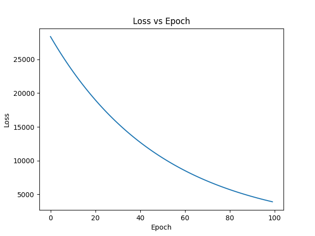

 📈 Linear Regression From Scratch

🎯 Objective
Implement Linear Regression using Gradient Descent from scratch using NumPy without any external library like sklearn.

🧠 Approach
- Defined data (house area and price) directly in code
- Normalized the input data for better convergence
- Implemented the hypothesis function
- Used the Mean Squared Error (MSE) method for loss calculation
- Used Gradient Descent for updating parameters
- Calculated the loss and plotted a graph

⚠️ Difficulties Faced
- Selection of the correct learning rate
- Slow convergence of Gradient Descent
- Gradient calculation

🛠️ Resolutions
- Normalization of data
- Selection of the correct learning rate (0.01)
- Verification of formulas

 📊 Results
- Loss value decreases gradually over a number of epochs
- The machine learned a linear relationship

 📈 Loss vs Epoch Graph

📚 Learnings
- Learned how Gradient Descent works
- Learned about the importance of the learning rate and data normalization
- Learned how Machine Learning works without any external library

 ✅ Conclusion
This project helped in understanding the core concept of Linear Regression and optimization using Gradient Descent.
